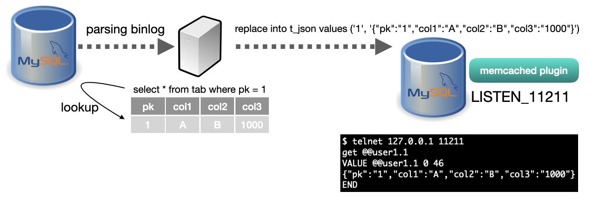

# uldra-binlog-json-transfer

## uldra-binlog-json-transfer is 
1. MySQL Binlog parser
2. Lookup by PK from source DB
3. Covert to JSON and save target DB

## build & run
    mvn install
    java -jar target/uldra-binlog-json-transfer-0.1-jar-with-dependencies.jar --config-file=config.yml

## replicate policy (config.yml)
    workerCount: 16
    wokerQueueSize: 100
    exporterPort: 42000
    
    .. skip ..
    
    binlogPolicies:
    - name: "source.user1"
      targetTable: "t_json"

## MySQL Innodb memcached plugin example
    ## Install
    $ mysql -uroot < innodb_memcached_config.sql
    $ mysql -uroot
    mysql> create database target;
    mysql> create table `target`.`t_json` (
        ->  `k` varchar(100) not null,
        ->  `v` mediumtext,
        ->  primary key (`k`)
        ->);
    mysql> use innodb_memcache
    mysql> delete from containers;
    mysql> insert into containers values ('user1', 'target', 't_json', 'k', 'v', 0,0,0, 'PRIMARY');
    mysql> UNINSTALL PLUGIN daemon_memcached; 
    mysql> INSTALL PLUGIN daemon_memcached soname "libmemcached.so"; 
    
    ## TEST
    $ telnet 127.0.0.1 11211
    get @@user1.1
    VALUE @@user1.1 0 46
    {"pk":"1","col1":"A","col2":"B","col3":"1000"}
    END
